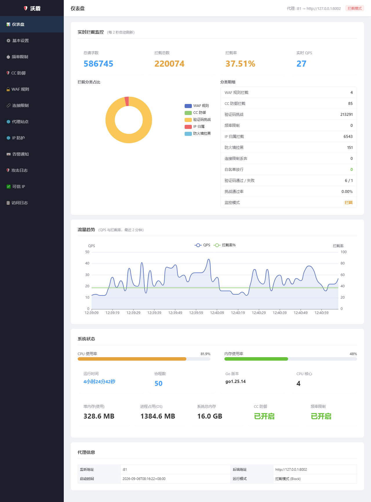
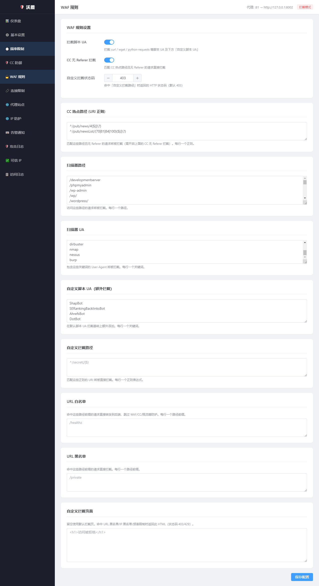

# 沃盾（warden）

> 一个用 Go 写的轻量级反向代理 WAF：单文件部署、内嵌管理后台、专注 CC 防护与攻击拦截。

沃盾（warden）基于 **Go + OWASP Coraza** 实现，把自己放在业务服务前面，
在 TCP / HTTP 两个层面完成**连接限流、频率限制、CC 防护、IP 归属拦截、WAF 规则检测**，
并把实时指标、攻击日志、可信 IP 等运维能力做成一个**内嵌在二进制里的管理后台**（无需额外部署前端）。

- 编译产物是**单个可执行文件**，前端资源（Vue3 + Element Plus + ECharts）通过 `go:embed` 打进二进制；
- 依赖的 SQLite 是**纯 Go 实现**（`modernc.org/sqlite`），**不需要 cgo**，交叉编译和分发都很简单；
- 面向真实攻击场景设计：新 IP 泛洪、脚本化 CC、扫描器探测、云厂商/国外 IP 刷量。

> 许可证：[Apache-2.0](LICENSE) ｜ 第三方组件声明：[NOTICE](NOTICE)

---

## 目录

- [项目简介](#项目简介)
- [核心特性](#核心特性)
- [技术架构](#技术架构)
- [目录结构](#目录结构)
- [快速开始](#快速开始)
- [配置说明](#配置说明)
- [部署方案](#部署方案)
- [管理后台](#管理后台)
- [可观测性与运维](#可观测性与运维)
- [常见问题与调优](#常见问题与调优)
- [开发](#开发)
- [安全说明](#安全说明)
- [开源协议](#开源协议)

---

## 项目简介

很多小站（企业官网、学校站点、内网业务系统）常年被两类流量困扰：

1. **CC / 爬虫刷量**：大量 IP 高频请求热点页面（新闻列表、详情页、搜索接口），把后端打满；
2. **扫描器与恶意探测**：`/wp-admin`、`/.env`、`/phpmyadmin` 之类的路径扫描，以及 sqlmap、nikto 等工具。

商业 WAF 成本高、云 WAF 需要改 DNS，而 Nginx 原生能力在**"如何区分正常用户和脚本"**上比较有限。
沃盾的定位就是：**用一个小巧的自托管程序，把 L4~L7 的防护 + CC 挑战 + 可观测性一次性解决**，
部署时只需把 Nginx（或直接对外）的流量指向它。

设计取向：

- **宁可多一次验证码，也不要误杀真实用户** —— 疑似脚本先弹验证码，验证通过即发放可信凭证；
- **快路径优先** —— 静态资源、可信 IP、可信会话直接放行，不进入慢速检测链路；
- **有状态但不失控** —— 所有内存状态都有 TTL 与后台清扫协程，长时间运行不会无界增长。

---

## 核心特性

### 🛡️ WAF 检测（Coraza）

- 基于 [OWASP Coraza](https://coraza.io/) v3，兼容 ModSecurity / OWASP CRS 规则语法；
- 内置脚本 UA 拦截、扫描器路径 / UA 拦截、自定义拦截路径（可配返回状态码）；
- 支持 `DetectionOnly`（观察）与 `On`（拦截）两种引擎模式，方便先观察再上线；
- 支持可选加载 OWASP CRS 规则集。

### 🌊 CC 防护（核心能力）

| 能力 | 说明 |
|---|---|
| 可信 IP 快路 | 累计访问达阈值即晋升可信，走独立高配额通道；可信列表持久化到 SQLite |
| 可信会话快路 | 验证码通过后签发 Cookie，同一 IP 下多用户互不影响 |
| 新 IP 泛洪检测 | 滑动窗口统计新/老 IP 占比，超过阈值判定为泛洪，新 IP 一律先过验证码 |
| 行为检测 | 请求间隔高度均匀、或长期只访问 1~2 个路径 → 判定为脚本 |
| 每 IP 限速 | 未可信 IP 独立令牌桶，超限弹验证码（不是直接断连） |
| 共享令牌桶 | 未可信总量保护，拥堵时用验证码自我恢复 |
| 点选数字验证码 | 自研轻量图形验证码，按 `(会话, IP)` 复用，避免重复生成把用户正在填的验证码冲掉 |
| 静态资源免检 | 图片 / JS / CSS / 字体等直接放行，避免"一篇文章几十个请求"被误伤 |
| 爬虫白名单 | 识别搜索引擎 UA，不弹验证码（改走限速） |
| 违规升级 | 违规次数 + **持续性**双条件满足才升级为内核层封禁，避免一次性 IP 也建规则 |

### 🌍 IP 归属拦截

- 基于离线 xdb 库（IP 地理 + IDC/云厂商归属），**无外部请求**；
- 可分别开关"国外 IP 拦截"与"云厂商/IDC IP 拦截"——真实用户几乎不会来自腾讯云/阿里云。

### ⏱️ 频率限制与连接限制

- **热点路径限流**：为新闻列表、数据接口等热点正则单独设阈值（滑动窗口）；
- **整站限流** 与 **/24 子网限流**：防止单 IP / 单网段刷量；
- **L4 连接限流**：在 TCP `accept` 阶段用令牌桶丢弃过量连接，不进入 HTTP 处理。

### 🚫 黑白名单

- IP 白名单（CIDR）直通、IP 黑名单直接拦截；
- URL 白名单 / 黑名单，支持正则。

### 🌐 多站点反向代理

- 按 `Host` 头把请求路由到不同上游（`sites` 配置），未命中走默认 `backend`；
- 自动注入 `X-Real-IP` / `X-Forwarded-For`，后端可拿到真实客户端 IP。

### 📊 内嵌管理后台

- Vue3 + Element Plus + ECharts，全部本地化（**不依赖 CDN**），通过 `go:embed` 打进二进制；
- 实时拦截指标、QPS/拦截率趋势图、拦截分类占比饼图、CPU/内存状态；
- 攻击日志查询与清空、可信 IP 分页浏览、访问日志查看；
- 配置在线修改（保存后按提示重启生效，带"需要重启"全局横幅）。

### 🗄️ 持久化与可观测

- SQLite 单文件（`data/warden.db`）：配置、攻击日志、可信 IP、（可选）防火墙封禁记录；
- 统一 `busy_timeout + WAL + 自动重试`，多连接并发写不丢数据；
- 攻击日志**批量事务写入** + 按天保留自动清理；
- 内置计数器指标 `/metrics`、健康检查 `/healthz`、访问日志按天/按大小轮转。

### 🔔 告警通知

- SMTP 邮件 + 通用 Webhook + 钉钉 / 企业微信 / 飞书机器人；
- 支持冷却时间（`cooldown_min`），避免告警风暴。

---

## 技术架构

### 请求链路

```text
                            客户端
                              │
                              ▼
              ┌───────────────────────────────┐
              │  Nginx / LB / TLS  (可选)      │
              └───────────────────────────────┘
                              │
                              ▼
┌──────────────────────────────────────────────────────────┐
│  沃盾 warden  (:81)                                       │
│                                                          │
│  【TCP 层】ConnLimitListener —— 令牌桶，超额连接直接丢弃     │
│  ──────────────────────────────────────────────────────  │
│  【HTTP 中间件链】由外到内：                                │
│    1. IP 黑名单        ── 命中 → 拦截                      │
│    2. URL 白/黑名单    ── 命中 → 放行 / 拦截                │
│    3. IP 白名单        ── 命中 → 直通（跳过后续检测）        │
│    4. CC 防护          ── 泛洪/行为/限速 → 验证码挑战        │
│    5. 频率限制         ── 热点/整站/子网 → 429              │
│    6. Coraza WAF       ── OWASP CRS 规则检测               │
│    7. 多站点 Router    ── 按 Host 反代到上游                │
└──────────────────────────────────────────────────────────┘
                              │
                              ▼
                  Tomcat / 业务后端  (:8002)
```

### CC 防护判定流程（简化）

```text
请求进入
  │
  ├─ 静态资源？ ──────────────── 是 → 直接放行
  ├─ IP 归属被拦（国外/云厂商）？ ─ 是 → 断开
  ├─ 可信会话 Cookie？ ────────── 是 → 可信通道放行
  ├─ 可信 IP？ ───────────────── 是 → 行为检测 → 可信通道放行
  │
  └─ 未可信 IP（慢速路径）
       │
       ├─ 新 IP 泛洪？ ── 是 → 记录违规 + 弹验证码
       ├─ 行为像脚本？ ── 是 → 弹验证码
       ├─ 会话异常？ ──── 是 → 断开
       ├─ 每 IP 超速？ ── 是 → 弹验证码
       ├─ 共享桶耗尽？ ── 是 → 弹验证码
       │
       └─ 正常 → 累计访问次数 → 达阈值晋升可信 IP → 放行
```

**验证码通过后**：签发可信会话 Cookie、写入可信 IP 列表（持久化）、清空该 IP 的违规计数。
**违规升级**：违规次数达到阈值 **且** 持续违规超过 `offender_persist_sec`，才判定为"顽固攻击者"，
在启用防火墙封禁时加入系统防火墙（Windows `netsh`）。

### 状态与持久化

| 数据 | 存储 | 说明 |
|---|---|---|
| 运行配置 | SQLite `config` 表 → 回退 `config.json` | DB 优先，管理后台改配置写 DB |
| 攻击日志 | SQLite `attack_log` 表 | 批量事务写入 + 按天清理 |
| 可信 IP | SQLite `trusted_ip` 表 | 重启后恢复 |
| 防火墙封禁 | SQLite `firewall_block` 表 | 重启后恢复 + 清理孤儿规则 |

> 所有 SQLite 访问统一使用 `busy_timeout=5000` + `WAL` + `sqlutil.Retry`（忙时退避重试），
> 避免多连接并发写导致的 `SQLITE_BUSY` 丢数据。

---

## 目录结构

```text
warden/
├── cmd/warden/            # 程序入口：装配中间件链、监听、优雅退出
├── internal/
│   ├── proxy/             # 核心代理层
│   │   ├── cc_defense.go  #   CC 防护（泛洪/行为/可信/验证码/违规升级）
│   │   ├── captcha.go     #   点选数字验证码生成与校验
│   │   ├── conn_limit.go  #   TCP 连接限流 + Windows 防火墙封禁
│   │   ├── ratelimit.go   #   热点/整站/子网频率限制
│   │   ├── ip_check.go    #   IP 归属（国外/云厂商）判定
│   │   ├── ip_whitelist.go#   IP 白/黑名单
│   │   └── access.go      #   黑名单 / URL 白黑名单中间件
│   ├── waf/               # Coraza 引擎封装与规则构建
│   ├── router/            # 多站点反向代理（含共享连接池）
│   ├── config/            # 配置结构体、默认值归一化、校验
│   ├── store/             # 配置持久化（DB 优先 + JSON 回退）
│   ├── attacklog/         # 攻击日志（批量写入 + 保留期清理）
│   ├── truststore/        # 可信 IP 持久化
│   ├── fwstore/           # 防火墙封禁记录持久化
│   ├── sqlutil/           # SQLite 忙重试工具
│   ├── admin/             # 管理后台 HTTP API（/api/*）
│   ├── metrics/           # 原子计数器指标
│   ├── accesslog/         # 访问日志与轮转
│   ├── alert/             # 邮件 / Webhook / 钉钉 / 企业微信 / 飞书告警
│   ├── blockpage/         # 自定义拦截页面
│   ├── restart/           # 服务重启
│   └── util/              # 通用工具（真实 IP、拒绝响应、系统 CPU/内存）
├── web/                   # 管理后台前端（go:embed 打包）
│   ├── admin.html         #   单文件 Vue3 应用
│   └── vendor/            #   Vue / Element Plus / ECharts（本地化，不依赖 CDN）
├── rules/
│   └── coraza.conf        # Coraza 规则文件
├── data/                  # SQLite 数据库（运行时生成，已 gitignore）
├── logs/                  # 访问/审计日志（运行时生成，已 gitignore）
├── config.json            # 默认配置
├── install.bat            # Windows：拉依赖 + 编译
├── run.bat                # Windows：启动
├── build.ps1              # PowerShell 编译
└── package.ps1            # 打包成可分发 zip
```

---

## 快速开始

### 环境要求

- **Go 1.23+**（`go.mod` 声明 `go 1.23.0`）
- Windows 10/11 或 Windows Server 2016+，或任意 Linux 发行版
- 无需 cgo / 无需数据库服务（SQLite 为纯 Go 实现，随程序内置）

### Windows

```powershell
# 1) 编译（自动使用国内模块镜像 goproxy.cn）
双击 install.bat

# 或者手动：
$env:GOPROXY="https://goproxy.cn,https://goproxy.io,direct"
go mod tidy
go build -o warden.exe ./cmd/warden

# 2) 启动（保持窗口打开）
双击 run.bat
# 或：.\warden.exe -config config.json
```

### Linux

```bash
export GOPROXY=https://goproxy.cn,https://goproxy.io,direct
go mod tidy
go build -o warden ./cmd/warden
./warden -config config.json
```

### 验证

```bash
curl http://127.0.0.1:81/healthz     # 健康检查（端口按 config.listen）
curl -I  http://127.0.0.1:81/        # 应转发到后端
```

管理后台：<http://127.0.0.1:9090>（默认监听本机，`admin.password` 为空时不启用认证）。

---

## 配置说明

配置文件为 `config.json`。**注意：运行配置以 SQLite 为准（DB 优先）**，
首次启动会把 `config.json` 导入 DB；之后请在管理后台修改（或改 DB），仅改 `config.json` 不会影响已运行的实例。

### 顶层

| 字段 | 类型 | 默认 | 说明 |
|---|---|---|---|
| `listen` | string | `:81` | WAF 监听地址。`80` 需管理员/root 权限 |
| `backend` | string | — | 默认上游地址，如 `http://127.0.0.1:8002` |
| `sites` | array | `[]` | 多站点路由：`{name, hosts[], backend}`，按 Host 匹配，未命中走 `backend` |
| `rules_file` | string | `rules/coraza.conf` | Coraza 规则文件路径 |
| `read_timeout_sec` | int | `60` | HTTP 读超时 |
| `write_timeout_sec` | int | `60` | HTTP 写超时 |
| `idle_timeout_sec` | int | `60` | 空闲连接超时（建议明显小于上游 keepalive 超时） |
| `access_log` | string | `logs/access.log` | 访问日志路径 |
| `access_log_rotate` | object | `{mode:"daily",max_size_mb:100}` | 轮转策略：`daily` 或 `size` |
| `attack_log_retain_days` | int | `90` | 攻击日志保留天数 |
| `block_requests` | bool | `true` | 频率限制命中时是否直接拦截（false 则仅记录） |
| `block_page` | string | — | 自定义拦截页面 HTML |
| `url_allowlist` | string[] | `[]` | URL 白名单（正则） |
| `url_blocklist` | string[] | `[]` | URL 黑名单（正则） |

### `rate_limit` 频率限制

| 字段 | 默认 | 说明 |
|---|---|---|
| `enabled` | `true` | 总开关 |
| `hot_path_max` / `hot_path_window_sec` | `300` / `30` | 热点路径在窗口内的最大请求数 |
| `hot_path_patterns` | `[]` | 热点路径正则列表（如新闻列表、数据接口） |
| `site_max_per_min` | `1200` | 整站单 IP 每分钟上限 |
| `subnet_max_per_min` | `2000` | 单 /24 子网每分钟上限 |

### `cc_defense` CC 防护

| 字段 | 默认 | 说明 |
|---|---|---|
| `enabled` | `true` | 总开关 |
| `global_qps_max` / `global_qps_burst` | `800` / `200` | 可信通道令牌桶 |
| `trust_ip_min_visits` / `trust_ip_window_sec` | `5` / `600` | 多少秒内访问多少次即晋升可信 IP |
| `trust_ip_ttl_sec` | `86400` | 可信 IP 有效期 |
| `new_ip_qps_max` / `new_ip_qps_burst` | `50` / `20` | 新 IP 令牌桶 |
| `new_ip_ratio_block` | `80` | 窗口内新 IP 占比超过该百分比（%）判定为泛洪 |
| `new_ip_check_sec` / `new_ip_check_min_reqs` | `30` / `60` | 判定窗口与最小样本量 |
| `flood_sliding_window_sec` | `600` | "新 IP"判定滑动窗口（窗口内出现过即视为老 IP） |
| `untrusted_ip_qps_max` / `untrusted_ip_burst` | `30` / `40` | 未可信 IP 单 IP 令牌桶 |
| `behavior_idle_reset_sec` | `600` | 行为状态空闲重置时间 |
| `challenge_cookie_key` | 自动生成 | 验证码 Cookie 签名密钥 |
| `firewall_offender_limit` | `20` | 违规次数阈值 |
| `offender_persist_sec` | `60` | **持续违规时长**：与次数阈值同时满足才升级 |
| `offender_ttl_sec` | `1800` | 违规记录内存保留时长 |

### `waf_rules` WAF 规则

| 字段 | 说明 |
|---|---|
| `cc_paths` | 需要 CC 保护的路径正则（无 Referer 时拦截） |
| `cc_no_referer_block` | 是否拦截无 Referer 访问 `cc_paths` |
| `block_script_ua` / `custom_script_uas` | 脚本类 UA 拦截与自定义列表 |
| `scanner_paths` / `scanner_uas` | 扫描器路径与 UA 黑名单 |
| `custom_block_paths` / `custom_block_status` | 自定义拦截路径与返回状态码 |

### `conn_limit` / `firewall_block` / `ip_*`

| 字段 | 默认 | 说明 |
|---|---|---|
| `conn_limit.max_conns_per_sec` / `burst` | `300` / `80` | TCP 层每秒新连接上限与突发容量 |
| `firewall_block.enabled` | `false` | 是否启用系统防火墙内核层封禁（**仅 Windows 有效**） |
| `firewall_block.auto_block` | `false` | 是否自动封禁顽固攻击者 |
| `firewall_block.expire_min` | `30` | 封禁自动过期时间（分钟） |
| `firewall_block.whitelist_cidrs` | `[]` | 不参与防火墙封禁的网段 |
| `ip_whitelist.enabled` / `cidrs` | `false` / `[]` | IP 白名单，命中直通 |
| `ip_blacklist.enabled` / `cidrs` | `false` / `[]` | IP 黑名单，命中拦截 |
| `ip_check.block_foreign` | `true` | 拦截国外 IP |
| `ip_check.block_cloud` | `true` | 拦截云厂商/IDC IP |

### `admin` 管理后台

| 字段 | 默认 | 说明 |
|---|---|---|
| `enabled` | `true` | 是否启用 |
| `listen` | `127.0.0.1:9090` | 监听地址，**建议只监听本机** |
| `username` / `password` | `admin` / 空 | `password` 为空则不启用认证 |

### `alert` 告警

| 字段 | 说明 |
|---|---|
| `enabled` | 总开关 |
| `smtp_host` / `smtp_port` / `smtp_username` / `smtp_password` / `smtp_from` / `smtp_tls` | SMTP 邮件 |
| `to` | 收件人列表 |
| `webhook_url` / `dingtalk_url` / `wecom_url` / `feishu_url` | 通用 Webhook 与各 IM 机器人 |
| `cooldown_min` | 同类告警冷却时间（分钟） |

---

## 部署方案

### 方案 A：Nginx 前置（推荐，便于 TLS 卸载）

```text
外网 :443 ──▶ Nginx（TLS 卸载）──▶ warden :81 ──▶ Tomcat :8002
```

Nginx 关键配置（**超时不要短于 WAF**，否则会出现大量 `upstream prematurely closed`）：

```nginx
upstream warden_backend {
    server 127.0.0.1:81;
    keepalive 64;                  # 复用与 WAF 的连接
}

server {
    listen 80;
    server_name www.example.com;

    location / {
        proxy_pass http://warden_backend;
        proxy_http_version 1.1;
        proxy_set_header Connection "";     # 配合 keepalive 必须
        proxy_set_header Host $host;
        proxy_set_header X-Real-IP $remote_addr;
        proxy_set_header X-Forwarded-For $proxy_add_x_forwarded_for;
        proxy_set_header X-Forwarded-Proto $scheme;

        proxy_connect_timeout 5s;
        proxy_read_timeout  60s;            # 与 warden read_timeout_sec 对齐
        proxy_send_timeout  60s;
    }
}
```

`config.json`：

```json
{
  "listen": ":81",
  "backend": "http://127.0.0.1:8002"
}
```

### 方案 B：WAF 直接对外

让 warden 直接监听 80/443（TLS 可在 Go 侧或由前置 LB 处理），可少一跳：

```json
{
  "listen": ":80",
  "backend": "http://127.0.0.1:8002"
}
```

> Windows 下监听 80 需要**以管理员身份**运行。

### 方案 C：多站点

```json
{
  "backend": "http://127.0.0.1:8002",
  "sites": [
    { "name": "主站", "hosts": ["www.example.com"], "backend": "http://127.0.0.1:8002" },
    { "name": "后台", "hosts": ["admin.example.com"], "backend": "http://127.0.0.1:8003" }
  ]
}
```

### 注册为系统服务

**Windows（NSSM）：**

```bat
nssm install warden "D:\waf\warden\warden.exe"
nssm set warden AppDirectory "D:\waf\warden"
nssm set warden AppParameters "-config config.json"
nssm start warden
```

**Linux（systemd）：**

```ini
# /etc/systemd/system/warden.service
[Unit]
Description=warden WAF
After=network.target

[Service]
Type=simple
WorkingDirectory=/opt/warden
ExecStart=/opt/warden/warden -config config.json
Restart=always
RestartSec=3

[Install]
WantedBy=multi-user.target
```

```bash
systemctl daemon-reload && systemctl enable --now warden
```

### 上线建议顺序

1. `rules/coraza.conf` 设 `SecRuleEngine DetectionOnly`，先观察误报；
2. 确认审计日志无误报后改为 `SecRuleEngine On`；
3. CC 防护先只开验证码挑战，观察真实用户通过率，再逐步收紧阈值。

---

## 管理后台

默认地址 `http://127.0.0.1:9090`（可在 `admin.listen` 修改）。

### 界面预览

**仪表盘** —— 实时拦截指标、QPS / 拦截率趋势图、拦截分类占比、系统状态与代理信息



**WAF 规则** —— 脚本 UA、扫描器路径 / UA、自定义拦截路径与返回状态码



### 功能菜单

| 菜单 | 功能 |
|---|---|
| 📊 仪表盘 | 实时指标、QPS/拦截率趋势图、拦截分类饼图、CPU/内存、代理信息 |
| ⚙️ 基本设置 | 监听、上游、超时、访问日志等 |
| ⏱️ 频率限制 | 热点路径、整站、子网阈值 |
| 🛡️ CC 防御 | 泛洪/可信/验证码/违规升级等全部参数 |
| 🔒 WAF 规则 | 脚本 UA、扫描器路径/UA、自定义拦截路径 |
| 🔗 连接限制 | TCP 连接限流 + **Windows 防火墙拦截**开关 |
| 🌐 代理站点 | 多站点 Host → 上游映射 |
| 🌐 IP 防护 | IP 白/黑名单、国外/云厂商拦截开关 |
| 📧 告警通知 | SMTP 与各 IM 机器人配置、发送测试 |
| 🛡️ 攻击日志 | 攻击事件分页查询与清空（进入该页才轮询） |
| ✅ 可信 IP | 可信 IP 列表分页浏览 |
| 📋 访问日志 | 实时查看访问日志尾部 |

修改配置后页面顶部会出现**"需要重启"**横幅，重启 WAF 后生效。

页面底部页脚常驻显示 **项目名 · 版本号 · 开源许可 · Go 版本**。点击页脚里的
**「Apache-2.0 开源许可」** 或 **「第三方组件声明」**，可在弹窗中直接查看 `LICENSE` / `NOTICE` 全文——
这两份文件通过 `go:embed` 打进二进制，无需额外附带文件即可在线阅读。

### 管理 API

所有接口在 `/api/*` 下，默认仅本机可访问：

| 方法 | 路径 | 说明 |
|---|---|---|
| GET | `/api/health` | 健康检查 |
| GET | `/api/config` | 读取当前配置 |
| PUT | `/api/config` | 保存配置（写入 DB） |
| GET | `/api/stats` | 运行状态（含 CPU/内存、是否需重启） |
| GET | `/api/metrics` | 计数器指标 |
| GET | `/api/logs` | 访问日志尾部 |
| GET | `/api/attack_logs` | 攻击日志（分页） |
| POST | `/api/attack_logs/clear` | 清空攻击日志 |
| GET | `/api/trusted_ips` | 可信 IP（分页） |
| POST | `/api/restart` | 重启服务 |
| POST | `/api/alert/test` | 发送测试告警 |
| GET | `/api/license` | Apache-2.0 许可全文（纯文本） |
| GET | `/api/notice` | 第三方组件声明（纯文本） |

---

## 可观测性与运维

### 指标

管理后台 API `GET /api/metrics`（JSON，默认仅本机可访问）：

| 指标 | 说明 |
|---|---|
| `total_requests` | 总请求数 |
| `waf_blocked` | WAF 规则拦截 |
| `cc_blocked` | CC 硬拦截（返回 403/429） |
| `cc_challenged` | 验证码挑战次数 |
| `captcha_passed` / `captcha_failed` | 验证码通过 / 失败 |
| `rate_limit_blocked` | 频率限制（429） |
| `conn_limit_dropped` | TCP 连接被丢弃 |
| `ip_check_blocked` | IP 归属拦截 |
| `firewall_blocked` | 防火墙封禁 |
| `whitelist_pass` | 白名单放行 |

> 拦截总数 = WAF + CC 硬拦截 + 验证码挑战 + 频率限制 + IP 归属 + 防火墙 + 连接丢弃。

### 日志

| 文件 | 内容 |
|---|---|
| `logs/access.log` | 经 WAF 转发的请求（按天/大小轮转，路径由 `access_log` 配置） |
| 标准输出 / 服务日志 | 启动信息、拦截事件、CC 挑战、Coraza 命中（`[coraza][...]`）等运行时日志 |
| `logs/startup-error.log` | 启动失败时的错误输出（由 `run.bat` 落盘） |

> Coraza 审计引擎默认关闭（`rules/coraza.conf` 里 `SecAuditEngine Off`），规则命中通过 `log`/`auditlog`
> 打到标准输出。若需要完整的审计文件，把该指令改为 `On` 并配置 `SecAuditLog` 路径。

### 常用排障

| 现象 | 排查方向 |
|---|---|
| 站点间歇 502 | 看 Nginx `error.log` 是否有 `upstream prematurely closed`（WAF 主动拦截）或 `10061 connection refused`（WAF 过载/未启动） |
| 真实用户被频繁挑战 | 调大 `trust_ip_min_visits` 门槛或降低 `new_ip_ratio_block`；确认静态资源未被挑战 |
| 验证码通过后仍被挑战 | 检查 `challenge_cookie_key` 是否稳定、会话 Cookie 是否被上游覆盖 |
| 内存/协程持续增长 | 观察 `token` 类状态 TTL 配置；确认没有大量外部命令（如 `netsh`）阻塞 |
| 配置改了不生效 | 运行配置以 DB 为准，需在后台保存并**重启** |

---

## 常见问题与调优

### 1. 为什么运行配置改 `config.json` 不生效？

配置读取顺序是 **SQLite `config` 表 → 回退 `config.json`**。
首次启动会用 `config.json` 初始化 DB，之后一律以 DB 为准。
请在管理后台修改，或清空 DB 里的 config 表后重新用 `config.json` 初始化。

### 2. Windows 版 Nginx 的 1024 连接上限

Windows 版 Nginx 使用 `select()` 事件模型，**单 worker 最多约 1024 个并发连接**，
`worker_connections` 设再大也不生效，被打满时会报
`maximum number of descriptors supported by select() is 1024` 并出现连接被拒。

如果站点并发较高，建议：把 Nginx 放到 **Linux / WSL2**，或**让 warden 直接对外**（Go 在 Windows 上使用 IOCP，无此限制）。

### 3. Windows 防火墙封禁（默认关闭）

早期版本会为**每个 IP** 创建 in/out 两条 `netsh` 规则，在攻击量下会迅速累积到上万条，
而 Windows 防火墙每次增删规则都要重编译整张规则表，导致操作极慢、甚至拖垮进程。

因此本项目**默认关闭**该功能。若要启用，请务必了解：

- 规则数会随封禁 IP 增长，需配合定期清理；
- 已有大量遗留规则时，不要在 PowerShell 里用 `Remove-NetFirewallRule` 逐条删（会被逐条重编译，极慢），
  而应停掉防火墙服务后**直接清理注册表**再启动服务。

### 4. 上游 keepalive 超时要对齐

WAF 到后端的空闲连接回收时间应**短于**后端（如 Tomcat `connectionTimeout`），
否则会复用已被后端关闭的连接，触发 `connection reset` → 502 / 重试抖动。

### 5. 加载 OWASP CRS 规则集（可选）

内置规则覆盖脚本 UA、扫描器路径/UA、SQLi / XSS / RCE / 路径穿越等常见特征。
需要更完整的检测能力时，可以挂载官方 CRS：

```bash
git clone --depth 1 -b v4.0.0 https://github.com/coreruleset/coreruleset.git rules/coreruleset
cp rules/coreruleset/crs-setup.conf.example rules/coreruleset/crs-setup.conf
```

在 `rules/coraza.conf` 末尾按需引入：

```apache
Include rules/coreruleset/crs-setup.conf
Include rules/coreruleset/rules/*.conf
```

> CRS 规则数量多、误报也相对更多，**务必**先用 `SecRuleEngine DetectionOnly` 观察一段时间，
> 确认真实业务的误报可接受后再切换到 `On`。

### 6. 调参思路（应对大规模 CC）

| 目标 | 调整 |
|---|---|
| 减少真实用户被挑战 | 降低 `new_ip_ratio_block`、增大 `trust_ip_min_visits` 的观察窗口 |
| 更早识别泛洪 | 减小 `new_ip_check_sec` / `new_ip_check_min_reqs` |
| 更早拦住顽固脚本 | 减小 `offender_persist_sec`（注意会更容易误伤短时突发） |
| 降低资源消耗 | 关闭 `firewall_block`（内核层封禁代价高）、收紧 `conn_limit` |
| 排查验证码通过率低 | 看 `captcha_passed / cc_challenged`，过低说明挑战过频或页面被脚本占据 |

---

## 开发

```bash
go build -o warden.exe ./cmd/warden   # 编译
go vet ./...                          # 静态检查
go test ./...                         # 单元测试
go run ./cmd/warden -config config.json
```

发布版本时可在构建时注入版本号（会显示在管理后台页脚与 `/api/health`）：

```bash
go build -ldflags "-X warden/internal/version.Version=1.2.3" -o warden.exe ./cmd/warden
```

- 前端为单文件 `web/admin.html`，修改后重新 `go build` 即会通过 `go:embed` 打包进二进制；
- 第三方前端库放在 `web/vendor/`（本地化，不走 CDN），`embed_test.go` 会校验资源是否齐全；
- 打包分发：`powershell -File package.ps1` 生成 `dist/warden.zip`。

欢迎提交 Issue / PR，建议：

1. 先开 Issue 说明场景与复现方式；
2. 提交前跑通 `go vet ./...` 与 `go test ./...`；
3. 涉及行为变更的配置项，请在 PR 中同步更新本 README 的配置表。

---

## 安全说明

- **管理后台默认无认证**（`admin.password` 为空），且默认只监听 `127.0.0.1`。
  如需远程访问，请**务必**设置强密码，并通过反向代理 + HTTPS + IP 白名单暴露；
- 管理后台不要直接暴露到公网；
- `config.json` 中可能包含 SMTP 密码等敏感信息，注意文件权限，不要提交到仓库；
- 本项目为应用层防护手段，**不能替代**系统补丁、最小权限、后端自身的安全编码。

---

## 开源协议

本项目采用 **Apache License 2.0**，全文见根目录 [`LICENSE`](LICENSE)。

```text
Copyright 2026 The warden Authors

Licensed under the Apache License, Version 2.0 (the "License");
you may not use this file except in compliance with the License.
You may obtain a copy of the License at

    http://www.apache.org/licenses/LICENSE-2.0
```

- 你可以自由使用、修改、分发本项目，**包括商业用途与闭源集成**，只需保留版权与许可声明；
- Apache-2.0 包含**明确的专利授权**，以及**商标条款**——协议不授予项目名称与 Logo 的商标使用权；
- 本项目所用的第三方开源组件及其许可协议，见根目录 [`NOTICE`](NOTICE)。

### 贡献

欢迎提交 Issue / PR。提交贡献即表示你同意以 Apache-2.0 协议授权你的贡献，
建议在提交信息中附带 `Signed-off-by`（DCO），便于追溯贡献来源。
